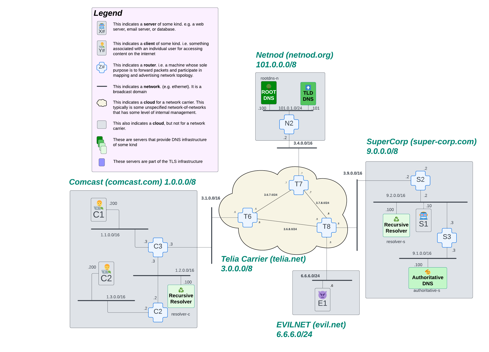

# X.1 Secure connections or: how do you trust who you're talking to?

Okay, so far our internet behaves the way it did in 1993* when the web was first invented. Back then, the internet was being used by academics sharing papers. Eventually, people started to buy things over the internet, and security has evolved to meet those needs.

Clearly, in a modern internet, we need to have some assurance when we're communicating over the internet that the server we're trying to reach is *in fact* the server we think it is. We would also like our communications with that server to be private.

Let's do an experiment! Let's see what it might look like for an attacker to intercept the traffic to a legitimate server with their own server. Let's `hopon client-c1` and make a web connection using `links http://server-s1.supercorp.com`. When you run that command, you should see something like this:

```unset
Welcome to server-s1!

We're here to meet all your server-s1 needs!

Please enter your credit card information:

Credit Card Number: __________________

Expiration Date: __________________

[ Submit ]

Thank you for visiting server-s1.
```

> To EXIT: press `esc` to open the menu. Press `enter` to open the `File` dropdown. Select `Exit`.

Okay. Here's the experiment: is there a way we can replace that web server and direct your traffic to an attacker's web server instead without you knowing that anything is different? This is actually quite easy, and achievable in a number of different ways.The simplest way we can do this is by getting into `router-t8` and making a one-line configuration change:

```bash
root@router-t8:/# iptables -t nat -A PREROUTING -d 9.2.0.10 -j DNAT --to-destination 6.6.6.6
```

This uses a command called [iptables](../../chapters/command-reference-guide.md#iptables), which is a tool that exists on every linux computer which allows you to intercept and alter network packets. This specific command above will cause `router-t8` to alter packets destined for `9.2.0.10` and change the destination IP address to `6.6.6.6`. The router will then see that it needs to route the packet down to EVILNET, as shown the following diagram:



Okay, so now that this "hack" is in place on `router-t8`, let's go back to our `client-c1` machine and check what's happening. In order to illustrate this clearly, let's also have a terminal running on our impersonating server, `server-e1`. On `server-e1`, let's run `tcpdump -n`:

```bash
root@server-e1:/# tcpdump -n
tcpdump: verbose output suppressed, use -v[v]... for full protocol decode
listening on eth0, link-type EN10MB (Ethernet), snapshot length 262144 bytes
```

Then, on `client-c1`, let's perfom a `ping`:

```bash
root@client-c1:/# ping 9.2.0.10 -c2
PING 9.2.0.10 (9.2.0.10) 56(84) bytes of data.
64 bytes from 9.2.0.10: icmp_seq=1 ttl=60 time=0.220 ms
64 bytes from 9.2.0.10: icmp_seq=2 ttl=60 time=0.336 ms
```

You'll notice on `client-c1`, it thinks its packets are reaching `9.2.0.10`. Nothing has changed from its perspective. However, take a look at the `tcpdump` output on `server-e1`:

```bash
19:35:55.854823 IP 1.1.0.200 > 6.6.6.6: ICMP echo request, id 101, seq 1, length 64
19:35:55.854883 IP 6.6.6.6 > 1.1.0.200: ICMP echo reply, id 101, seq 1, length 64
19:35:56.872497 IP 1.1.0.200 > 6.6.6.6: ICMP echo request, id 101, seq 2, length 64
19:35:56.872525 IP 6.6.6.6 > 1.1.0.200: ICMP echo reply, id 101, seq 2, length 64
```

You can see that this server is now receiving packets from `1.1.0.200` (our client), but now those packets are destined for `6.6.6.6`, our attacking server. This attack is impossible for `client-c1` to detect. Furthermore, if `client-c1` attempts to make a web connection as it did before, the traffic gets directed to our new malicious server without the client being able to guess what happened:

```bash
root@client-c1:/# links http://server-s1.supercorp.com
```

And now you'll see the website from the attacking server:

```unset
Welcome to EVIL NET!

We're super EVIL over here!

Please enter your credit card information:

Credit Card Number: __________________

Expiration Date: __________________

[ Submit ]

We will def take good care of your credit card information...
:maniacal laugh:
```

So now we understand the problem. What do we do about this?

Just like we've done in other chapters, let's start with the simplest possible thing that could work. How can we get two machines to talk securely to each other so that this attack fails?

## Goals

1. Understand why /how internet requests can get intercepted
2. understand what tools are available to secure a connection between two machines: openssh (two different modes) and vtunnel
3. use one of those tools to build a secure connection
4. show how the attack we did now fails
5. maybe talk about how this scales or doesn't

### OpenSSH: or -- the swiss-army-knife of network security

OpenSSH is a tool that network and computer administrators have been using for decades whenever they want to add a little security to their networks. It is amazingly versatile. You can use it to make a secure connection from one computer to another or even from one network to another. It's very much a swiss-army knife for network security, so let's dig in and see how we can make it work in this situation!

#### Option 1. Make a secure connection from one computer to another using openssh

### Option 2. That's nice, but what if we'd like more computers to talk to each other: openssh port-forwarding

### Vtunnel. That's nice, but openssh doesn't scale well. implement a real VPN


